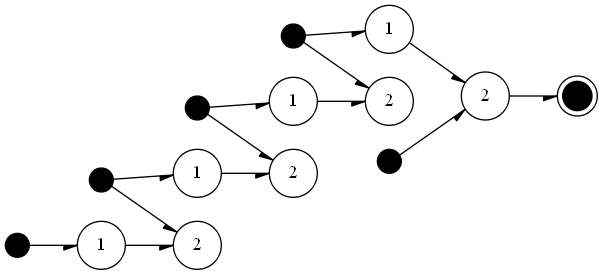
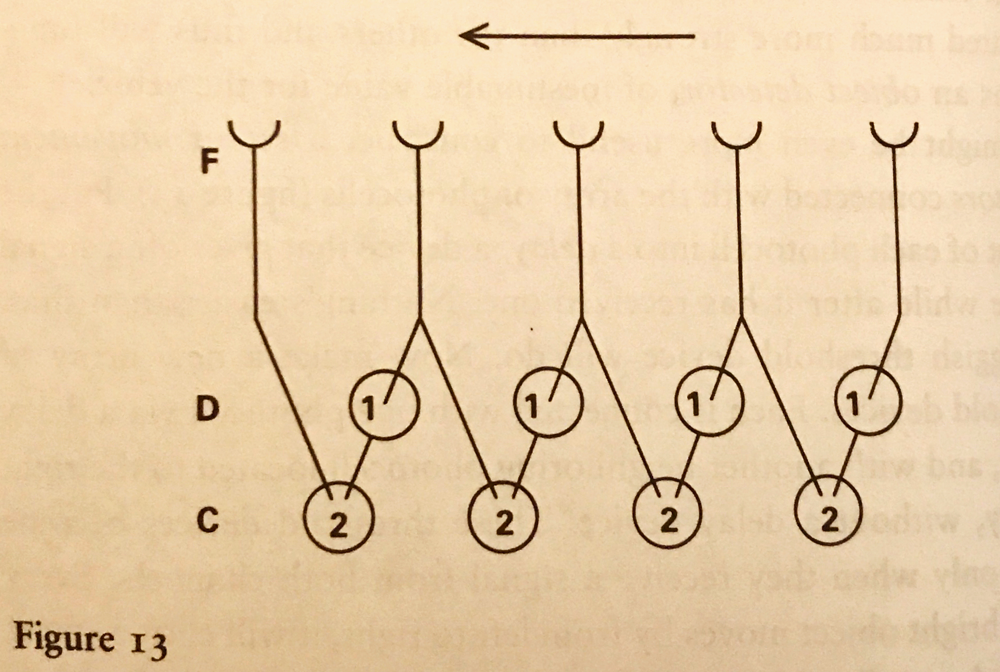
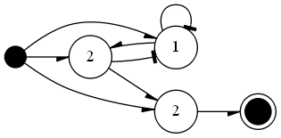
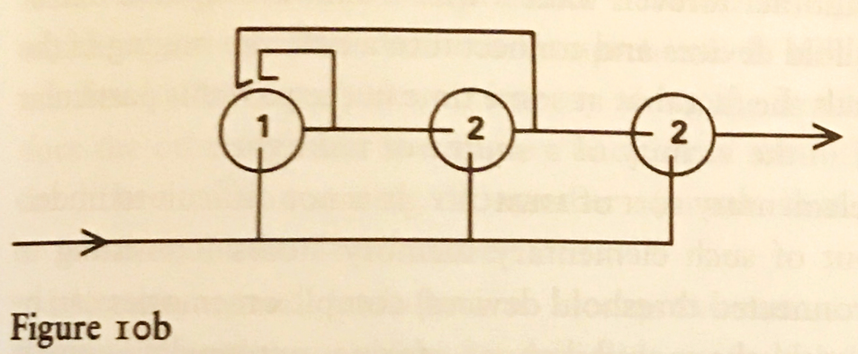

# VEHICLES

 This hobby project is an (ongoing) implementation of the vehicles described in the book "Vehicles - Experiments in Synthetic Psychology" written by Valentino Braitenberg. Currently it is only a prototype/proof-of-concept, closely following the book and showcasing some of the simple examples mentioned in it. Right now it only supports creation of simple threshold devices, and includes placeholders for sensors and actuators in order to provide input and get output to/from threshold devices. As a bonus a graph generator is implemented to visualize the created threshold devices. Nodes and the connections in the device are outputted in DOT language and rendered with graphviz.

 ## 1. Example threshold devices :
Graphviz Output             |  Original
:-------------------------:|:-------------------------:
  |  
|right to left movement detection|[1] p.36 Figure 13.
  |  
|three pulse detection|[1] p.23 Figure 10b.


[1] V. Braitenberg, Vehicles, experiments in synthetic psychology. Cambridge, MA: MIT Press, 1984. 

## How it works

The most basic threshold device is made up from a manager object, sensor, threshold node and an output (wire elements are automatically created when two elements are connected). After an input is provided, the manager`s update function is called and the input is propagated throughout the device. Since the system architecture is serial and each element needs to perform calculations that may have to be done concurrently, the update function is made up from smaller updates.


### Manager

Manager object represents the threshold device and it is the first element that needs to be initialized. 
It wraps all the other elements and calls each element`s update function in the order:
* update thresholds
* update wires
* update actuators

After the updates, manager`s time value is incremented by one. Manager also includes auxiliary functions for visualization of the device.


Functions :
* `self.get_thresholds()` — returns all the internal threshold values at a given time step.
* `self.display()` — prints out the elements and their connections in the device.
* `self.dot_generator()` — returns the generated DOT source which can be used with graphviz.

The only parameter a manager object has is the verbose option which is set True by default.

* `mng = manager(verbose = bool)` — This option provides information about the device after each update operation.

```
>>> mng.update()

Thresholds at time 0 after the signal: 
[1, 0, 0, 0, 0, 0, 0, 0]
Threshold outputs at time 0
thr_HN4F --> wire_T4LP
Thresholds at time 0 after threshold update: 
[0, 0, 0, 0, 0, 0, 0, 0]
Wire outputs at time 0
thr_HN4F --> thr_2XKJ with : wire_T4LP
thr_M7RG --- thr_33OG with : wire_IFYK
thr_CLCH --- thr_RENC with : wire_OPUM
thr_YY42 --- thr_JA5Z with : wire_ORDJ
thr_JA5Z --- act_H2ZE with : wire_C7G2
Thresholds at time 0 after wire update: 
[0, 0, 0, 0, 1, 0, 0, 0]
```

### Sensor(signal input wrapper)

Sensor object is a wrapper for the signal input class which makes it easier to create input arrays. Signal inputs are created and added to the inputs array of the sensor object when it is initialized. Currently it is used as a simple input method which only accepts values 1 or 0. 

Functions : 
* `self.add_consumer(consumer, type = int[0-1], position = (x,y))` — Adds the provided element to the signal input at the position (x,y) as a consumer. Type determines if the output is going to "signal" or "inhibit" the consumer.
* `self.feed([input])` — Feeds the input array to the appropriate signal inputs.

Sensor object requires a manager object and a size/dimension as its parameters.
* `sns = sensor(manager, (int, int))`

```
mng = manager(verbose = True)
sns = sens(mng,(1,5))
...

sns.feed([0,0,0,0,0])
```

### Threshold

Threshold nodes get input from their producers, compare the current input to their threshold values and send an output signal to their consumers depending on the result of the comparison.
* `input = inhibition( --| ) => current = current - 1`
* `input = signal( --> ) => current = current + 1`

Functions : 
* `self.add_consumer(consumer, type = int[0-1])` — Adds the provided element as a consumer. Type determines if the output is going to "signal" or "inhibit" the consumer. The type value in this case is used to create a wire with the desired type between the self and its consumer. Signaling and inhibition is done by wires, threshold nodes only output 1 or 0 for activated or not activated. 

Threshold object requires a manager object and a threshold value as its parameters.
* `thr = threshold(manager, int)`

```
mng = manager(verbose = True)
sns = sens(mng,(1,1))
thr = threshold(mng,1)
sns.add_consumer(thr,0,(0,0))
```

### Actuator

Actuator object is currently a placeholder. It is used as a simple output method. Actuators only print "ACTIVATED" if their producers send a signal. 

Actuator object only requires a manager object as its parameter.
* `act = actuator(manager)`

Now we have a working threshold device

```
mng = manager(verbose = True)
sns = sens(mng,(1,1))
thr = threshold(mng,1)
sns.add_consumer(thr,0,(0,0))
thr.add_consumer(act,0)

sns.feed([[1]])
mng.update()
```
Other examples can be found in the notebooks.